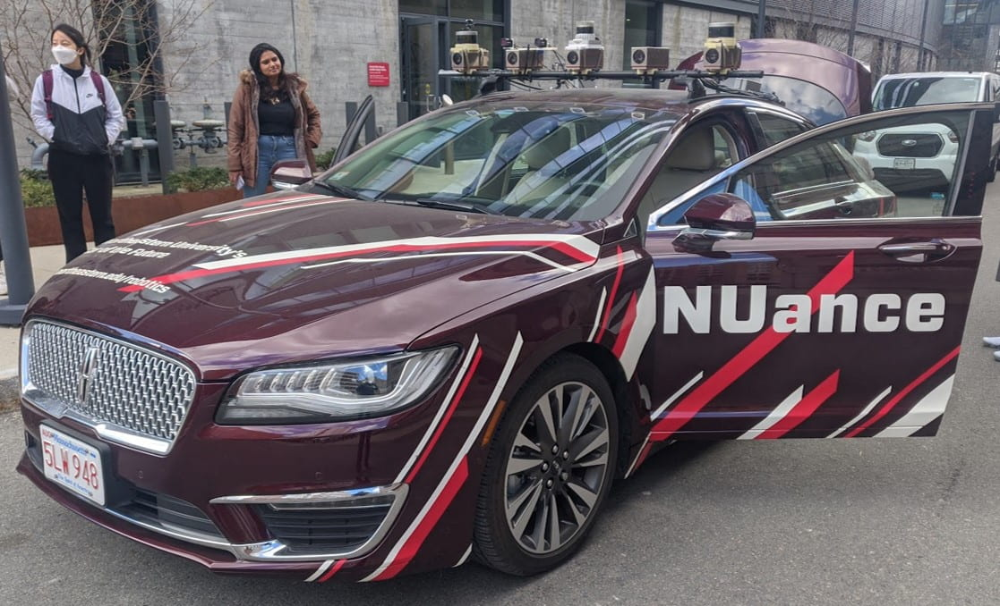
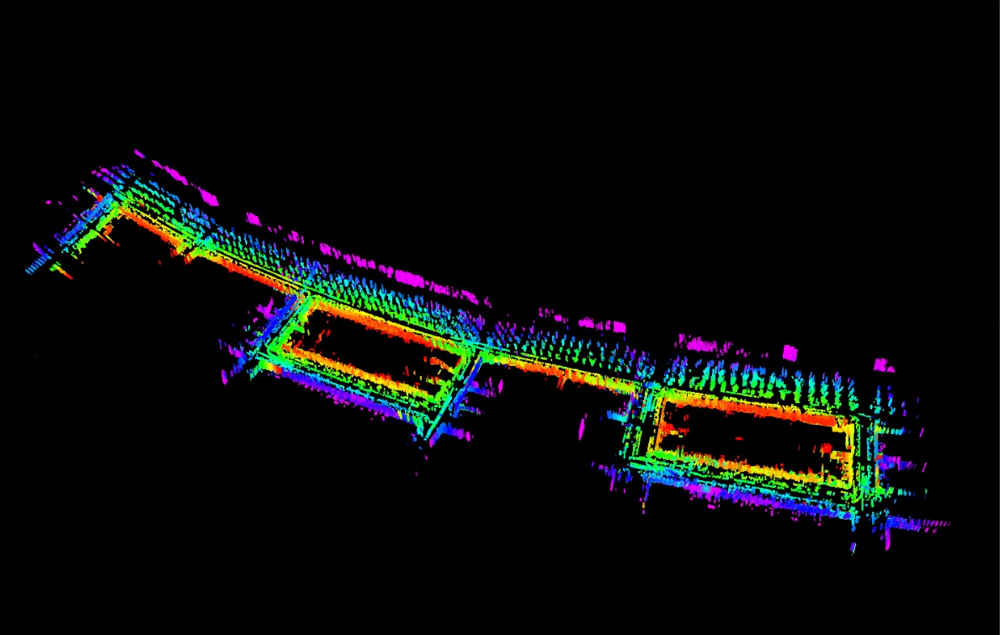

# LEGO-LOAM Boston Streets Mapping

A detailed point cloud mapping system for Boston streets using the LEGO-LOAM (Lightweight and Ground-Optimized LiDAR Odometry and Mapping) algorithm on the NUANCE autonomous vehicle platform.

## 🎯 Project Overview

This project implements and optimizes the LEGO-LOAM SLAM (Simultaneous Localization and Mapping) system for creating high-resolution point cloud maps of urban environments. Specifically designed for mapping Boston streets, the system processes data collected from the NUANCE autonomous vehicle equipped with multiple sensors to generate accurate 3D representations of urban landscapes.

### Key Features

- **Real-time 6-DOF pose estimation** using LiDAR and IMU data fusion
- **Computationally efficient** processing optimized for ground vehicles
- **High-accuracy mapping** with sub-meter precision in urban environments
- **Multi-sensor integration** supporting LiDAR, IMU, GPS, and thermal cameras
- **ROS-based architecture** for seamless integration with autonomous systems

## 🚗 Sensor Configuration

The system is configured for the NUANCE vehicle's sensor suite:

- **Velodyne VLP-16 LiDAR**: 16 scan lines, 0.2° horizontal resolution
- **VectorNAV 9-DOF IMU**: Inertial measurements for motion prediction
- **GPS**: Global positioning and trajectory validation
- **Thermal Camera**: Environmental context and obstacle detection

<div align="center">
  
  <p><em>The NUANCE autonomous vehicle platform used for data collection</em></p>
</div>

This project implements and optimizes the LEGO-LOAM SLAM (Simultaneous Localization and Mapping) system for creating high-resolution point cloud maps of urban environments. Specifically designed for mapping Boston streets, the system processes data collected from the NUANCE autonomous vehicle equipped with multiple sensors to generate accurate 3D representations of urban landscapes.

### Key Features

- **Real-time 6-DOF pose estimation** using LiDAR and IMU data fusion
- **Computationally efficient** processing optimized for ground vehicles
- **High-accuracy mapping** with sub-meter precision in urban environments
- **Multi-sensor integration** supporting LiDAR, IMU, GPS, and thermal cameras
- **ROS-based architecture** for seamless integration with autonomous systems

## 🚗 Sensor Configuration

The system is configured for the NUANCE vehicle's sensor suite:

- **Velodyne VLP-16 LiDAR**: 16 scan lines, 0.2° horizontal resolution
- **VectorNAV 9-DOF IMU**: Inertial measurements for motion prediction
- **GPS**: Global positioning and trajectory validation
- **Thermal Camera**: Environmental context and obstacle detection

## 🏗️ System Architecture

The LEGO-LOAM system consists of four main ROS nodes:

### 1. Image Projection (`imageProjection`)

- Processes raw LiDAR point cloud data
- Projects 3D points onto 2D range images
- Performs ground segmentation and feature extraction
- Handles VLP-16 specific parameters and calibration

### 2. Feature Association (`featureAssociation`)

- Extracts edge and surface features from segmented point clouds
- Associates features between consecutive scans
- Performs scan-to-scan matching for local odometry
- Integrates IMU data for motion prediction

### 3. Map Optimization (`mapOptmization`)

- Performs scan-to-map optimization using GTSAM
- Manages keyframe selection and submap generation
- Handles loop closure detection and global optimization
- Maintains map consistency and trajectory accuracy

### 4. Transform Fusion (`transformFusion`)

- Fuses odometry and mapping results
- Publishes final pose estimates and coordinate transforms
- Manages ROS TF tree for multi-sensor integration

<div align="center">
  
  <p><em>High-resolution point cloud map of Boston streets generated by LEGO-LOAM</em></p>
</div>

## 📋 Prerequisites

### System Requirements

- Ubuntu 16.04/18.04/20.04
- ROS Kinetic/Melodic/Noetic
- C++14 compatible compiler
- 8GB+ RAM recommended

### Dependencies

```bash
# ROS packages
sudo apt-get install ros-$ROS_DISTRO-tf
sudo apt-get install ros-$ROS_DISTRO-pcl-ros
sudo apt-get install ros-$ROS_DISTRO-pcl-conversions
sudo apt-get install ros-$ROS_DISTRO-cv-bridge
sudo apt-get install ros-$ROS_DISTRO-image-transport

# Additional libraries
sudo apt-get install libgtsam-dev
sudo apt-get install libpcl-dev
sudo apt-get install libopencv-dev
```

## 🚀 Installation

1. **Clone the repository**

```bash
cd ~/catkin_ws/src
git clone https://github.com/yourusername/lego-loam-boston-mapping.git
```

2. **Build the package**

```bash
cd ~/catkin_ws
catkin_make
source devel/setup.bash
```

3. **Download sample data** (optional)

```bash
# Download sample rosbag files for testing
wget [sample_data_url]
```

## 🎮 Usage

### Running the System

1. **Launch all nodes**

```bash
roslaunch lego_loam run.launch
```

2. **Play rosbag data**

```bash
rosbag play your_data.bag
```

3. **Visualize results in RViz**

```bash
rviz -d launch/test.rviz
```

### Configuration

Key parameters can be modified in `include/utility.h`:

```cpp
// LiDAR Configuration (VLP-16)
const int N_SCAN = 16;                    // Number of scan lines
const int Horizon_SCAN = 1800;            // Horizontal resolution
const float ang_res_x = 0.2;              // Horizontal angular resolution
const float ang_res_y = 2.0;              // Vertical angular resolution

// Processing Parameters
const float scanPeriod = 0.1;             // Scan period (10Hz)
const float mappingProcessInterval = 0.3; // Mapping update interval
const bool loopClosureEnableFlag = false; // Loop closure (disabled for real-time)
```

### Data Format

The system expects the following ROS topics:

- `/velodyne_points` (sensor_msgs/PointCloud2): LiDAR point cloud data
- `/imu/data` (sensor_msgs/Imu): IMU measurements
- `/gps/fix` (sensor_msgs/NavSatFix): GPS data (optional)

## 📊 Performance

### Accuracy Metrics

- **Localization accuracy**: < 0.1m in typical urban environments
- **Mapping precision**: Sub-meter resolution for detailed street mapping
- **Real-time performance**: 10Hz processing rate on standard hardware

### Computational Requirements

- **CPU**: Intel i7 or equivalent (4+ cores recommended)
- **Memory**: 8GB RAM minimum, 16GB recommended
- **Storage**: SSD recommended for large datasets

<div align="center">
  
  
  <p><em>Left: Real-time odometry trajectory estimation | Right: Point cloud segmentation and feature extraction</em></p>
</div>

## 🗺️ Boston Streets Dataset

This implementation has been specifically tested and optimized for:

- **Urban environments** with buildings, vehicles, and pedestrians
- **Varied terrain** including hills, intersections, and road conditions
- **Dynamic obstacles** typical of city driving scenarios
- **GPS-denied areas** where LiDAR-based localization is critical

## 🔧 Customization

### Adding New Sensors

1. Modify `utility.h` to include new sensor topics
2. Update the appropriate node to process new data types
3. Add coordinate frame transformations in `transformFusion.cpp`

### Supporting Different LiDAR Models

The system can be adapted for other LiDAR sensors by modifying parameters in `utility.h`:

```cpp
// Example: HDL-32E configuration
// const int N_SCAN = 32;
// const float ang_res_y = 41.33/float(N_SCAN-1);
// const float ang_bottom = 30.67;
```

## 📝 Publications

This work is based on the original LEGO-LOAM paper:

- Shan, T., & Englot, B. (2018). LeGO-LOAM: Lightweight and Ground-Optimized Lidar Odometry and Mapping on Variable Terrain. In IEEE/RSJ International Conference on Intelligent Robots and Systems (IROS).
